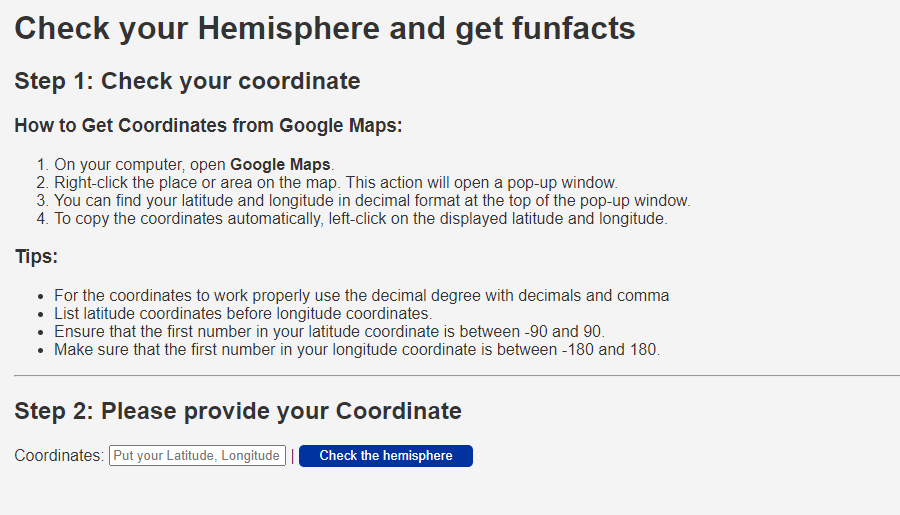

<h1>Hemisphere Checker 🌎</h1>

    
    
    
    

<h2 id="features">Features</h2>

<ul>
    <li>Input latitude and longitude to determine the hemisphere.</li>
    <li>Get fun facts about the respective hemisphere.</li>
    <li>Responsive design to use on any device.</li>
</ul>

<h2 id="demo">Demo</h2>

Link to a live demo : <a href="https://otopfolio.github.io/HemisphereChecker/">Hemisphere Checker Demo</a>

<h2 id="screenshots">Screenshots</h2>

Here you can put some screenshots of your app (replace with your actual screenshots):

<h2 id="installation">Installation</h2>

<ol>
    <li>Clone this repository:</li>
    <pre>git clone https://github.com/your-username/hemisphere-checker.git</pre>
    <li>Navigate to the directory:</li>
    <pre>cd hemisphere-checker</pre>
    <li>Open <code>index.html</code> in your preferred browser.</li>
</ol>

<h2 id="usage">Usage</h2>

Simply enter your latitude and longitude in the provided input fields and click the "Check Hemisphere" button. The result will display the hemisphere along with some fun facts.

<h2 id="contributing">Contributing</h2>

Pull requests are welcome. For major changes, please open an issue first to discuss what you would like to change.

<h2 id="license">License</h2>

<a href="https://choosealicense.com/licenses/mit/">MIT</a>

